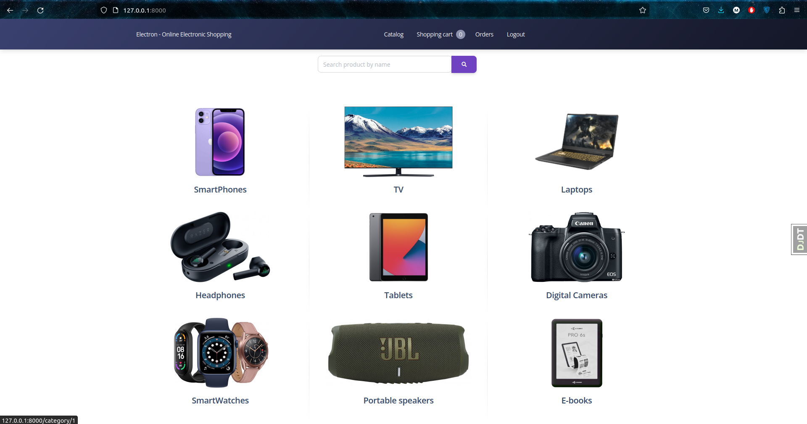

# Shop Electron Project

Django project where you can "buy" some stuff

## Check it out

[Shop Electron Project deployed to Render](https://electron-cish.onrender.com/)

## Credential for testing:
```
Login: user
Password: user123456
```

## Installation

Python3 must be already installed

```shell

git clone https://github.com/manjustice/shop_electron.git
cd shop_electron
python -m venv venv
source venv/bin/activate (on Linux/maOS)
venv\Scripts\activate (on Windows)
pip install -r requirements.txt
export SECRET_KEY="<your_secret_key>"
python manage.py migrate
python manage.py runserver
```

## Features

* Authentication/Registration functionality
* Add products to the shopping cart
* Delete products from the shopping cart
* Check your order
* Add products on the admin panel

## Demo

